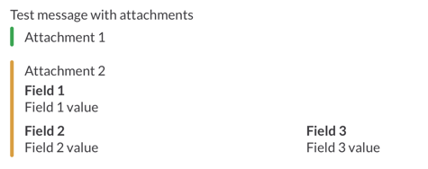

Slack
=====
`Slack`_ is a platform for team communication.

django-channels uses `Incoming WebHooks`_ which is one of the `Slack API`_ for sending notifications.

Settings
--------
You can obtain a Webhook URL from `this page`_.

.. code-block:: python

   CHANNELS = {
       "CHANNELS": {
           "channels.backends.slack.SlackChannel": {
               # Required
               # Webhook URL
               "url": "https://hooks.slack.com/services/ABCDEF/GHIJKLM/1234567890",
               # Optional
               "username": "django-channels",
               # You can set either icon_url or icon_emoji
               "icon_url": "https://slack.com/img/icons/app-57.png",
               "icon_emoji": ":ghost:",
               # Ex. 1 "channel": "#general"
               # Ex. 2 "channel": "@username"
               "channel": "#general"
           }
       }
   }

Options
-------
You can specify ``attachments`` and ``unfurl_links`` in options.

Attachments
^^^^^^^^^^^
You can send richly-formatted messages using ``attachments``.
For more information on ``attachments``, please refer to `Attachments`_.

.. code-block:: python

   import channels

   channels.send("Test message with attachments", options={
       "slack": {
           "attachments": [
               {
                   "fallback": "Attachment 1",
                   "text": "Attachment 1",
                   "color": "#36a64f"
               },
               {
                   "fallback": "Attachment 2",
                   "text": "Attachment 2",
                   "color": "warning",
                   "fields": [
                       {
                           "title": "Field 1",
                           "value": "Field 1 value",
                           "short": False
                       },
                       {
                           "title": "Field 2",
                           "value": "Field 2 value",
                           "short": True
                       },
                       {
                           "title": "Field 3",
                           "value": "Field 3 value",
                           "short": True
                       }
                   ]
               }
           ]
       }
   })

Unfurling
^^^^^^^^^
For more details on ``unfurl_links``, please refer to `Unfurling`_.

.. code-block:: python

   import channels

   channels.send("Sample notification.", options={
       "slack": {
           "unfurl_links": True
       }
   })

.. _Slack: https://slack.com/
.. _Incoming WebHooks: https://api.slack.com/incoming-webhooks
.. _Slack API: https://api.slack.com/
.. _this page: https://my.slack.com/services/new/incoming-webhook
.. _Attachments: https://api.slack.com/docs/attachments
.. _Unfurling: https://api.slack.com/docs/unfurling
